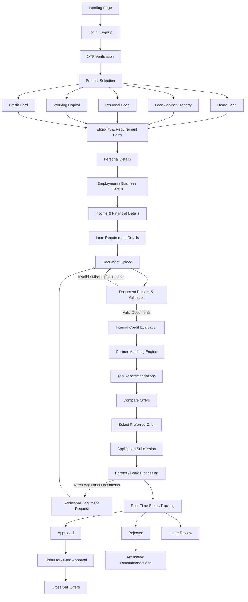

```mermaid id="g0o4yt"
flowchart TD

    A[Landing Page] --> B[Login / Signup]
    B --> C[OTP Verification]

    C --> D[Product Selection]

    D --> D1[Home Loan]
    D --> D2[Loan Against Property]
    D --> D3[Personal Loan]
    D --> D4[Working Capital]
    D --> D5[Credit Card]

    D1 --> E[Eligibility & Requirement Form]
    D2 --> E
    D3 --> E
    D4 --> E
    D5 --> E

    E --> F[Personal Details]
    F --> G[Employment / Business Details]
    G --> H[Income & Financial Details]
    H --> I[Loan Requirement Details]

    I --> J[Document Upload]

    J --> K[Document Parsing & Validation]

    K -->|Invalid / Missing Documents| J
    K -->|Valid Documents| L[Internal Credit Evaluation]

    L --> M[Partner Matching Engine]

    M --> N[Top Recommendations]

    N --> O[Compare Offers]
    O --> P[Select Preferred Offer]

    P --> Q[Application Submission]

    Q --> R[Partner / Bank Processing]

    R -->|Need Additional Documents| S[Additional Document Request]
    S --> J

    R --> T[Real-Time Status Tracking]

    T --> U[Approved]
    T --> V[Rejected]
    T --> W[Under Review]

    U --> X[Disbursal / Card Approval]

    X --> Y[Cross Sell Offers]

    V --> Z[Alternative Recommendations]
```
